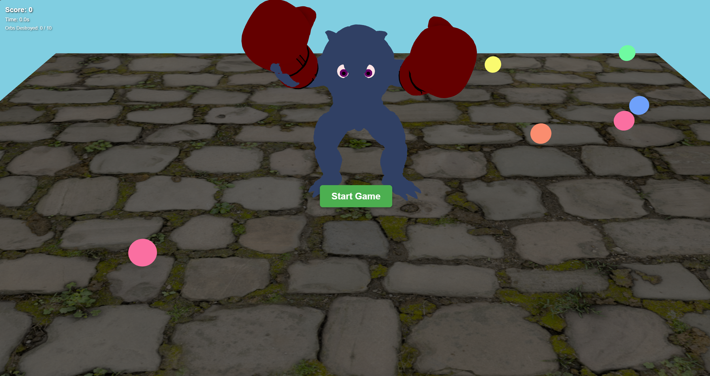
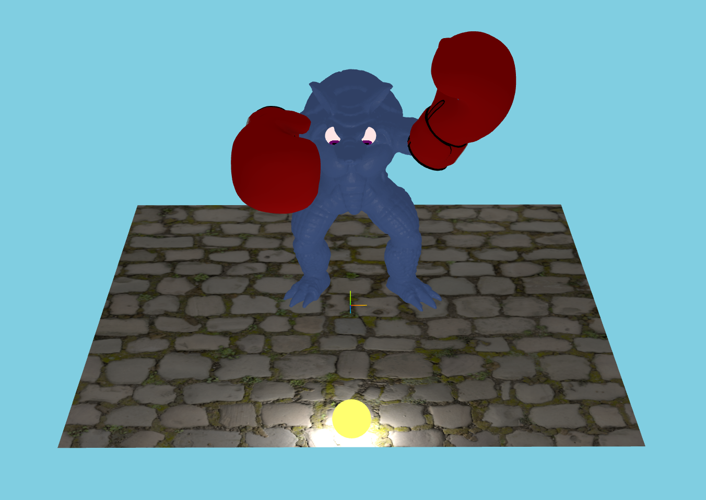
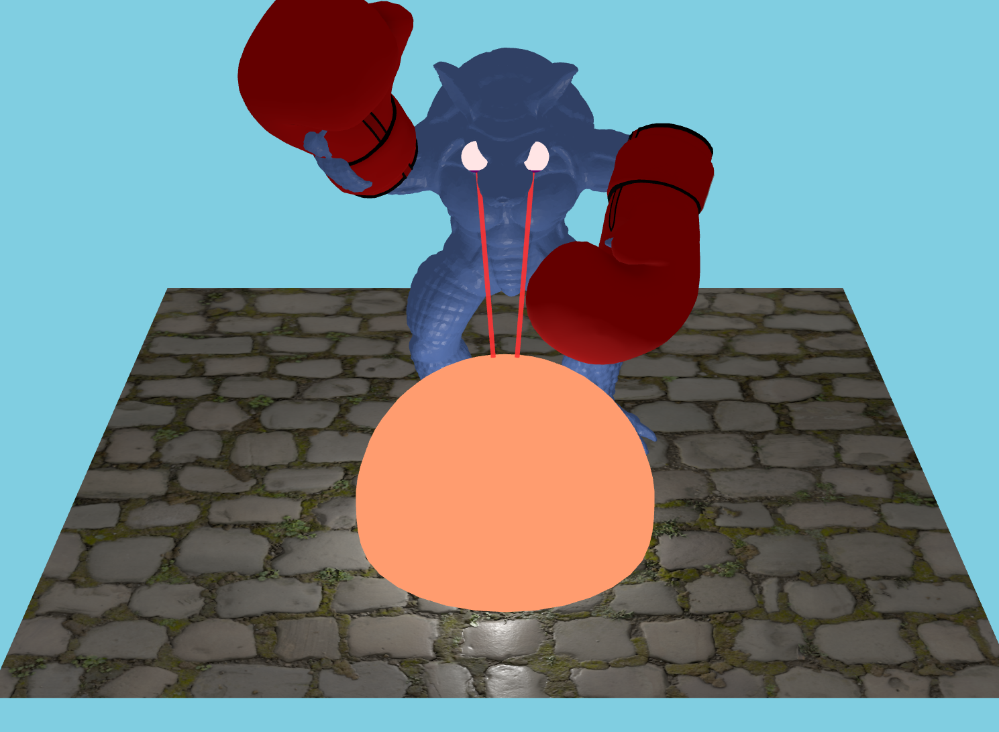
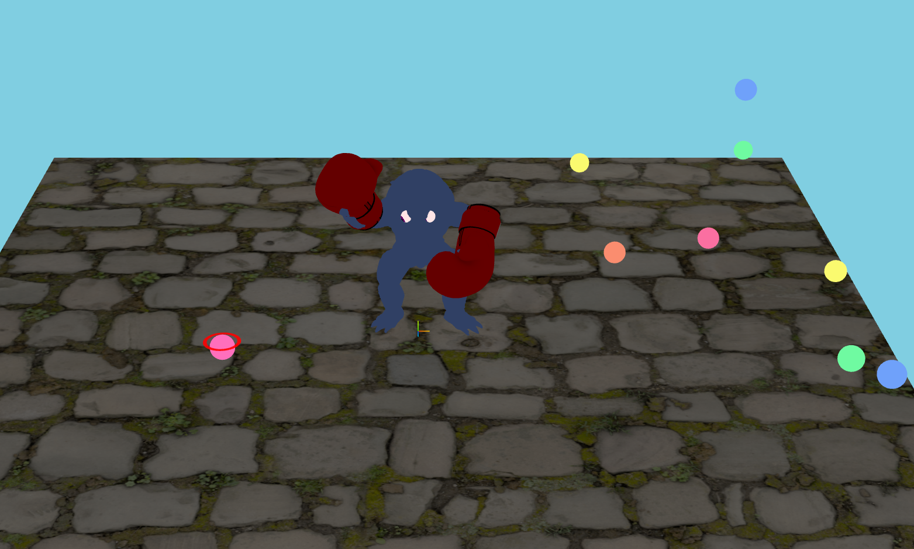

# Armadillo-IKAndShaders — Interactive 3D WebGL Project

A WebGL-based 3D graphics project built with Three.js, featuring a rigged armadillo character with inverse kinematics, custom eye shaders, skeletal animation, and interactive laser and sphere effects.



## 📋 Overview

This project demonstrates hierarchical transformations, skeleton rigging, and custom GLSL shaders in WebGL. It uses a glTF rigged armadillo model with boxing gloves attached to the skeleton, googly eyes that track a moving sphere, laser beams when the sphere is close, and a sphere that grows and changes color when hit by the lasers. The project has two versions: a core implementation and an extended version with additional features.

## ✨ Features

### Core Features
- **glTF Character**: Rigged armadillo model loaded via GLTFLoader with full skeletal hierarchy
- **Skeleton Attachment**: Boxing gloves attached to the armadillo’s hand bones so they move with the character
- **Hand Waving**: Animated waving that speeds up as the floating sphere gets closer
- **Googly Eyes**: Two eyeball meshes placed on the armadillo with custom eye shaders (pupil and iris)
- **LookAt**: Eyes continuously orient toward the sphere using `lookAt` as the sphere moves
- **Laser Eyes**: When the sphere is within a distance threshold, two lasers are drawn from the eyes to the sphere with custom geometry and material
- **Sphere Reaction**: When hit by the lasers, the sphere grows in size and its color interpolates over time (e.g. via `Color.lerp`)
- **Custom Shaders**: GLSL vertex and fragment shaders for the eyes (in `glsl/eye.vs.glsl`, `glsl/eye.fs.glsl`)
- **Interactive Controls**: Keyboard to move the sphere; orbit/pan/zoom for the camera

### Part 2 Extended Features (Part g)
- **Extended floor**: Larger play area (80×80) for more movement
- **Random orbs**: Multiple collectible orbs spawn at random positions on the floor
- **WASD controls the armadillo**: Move the character (not the sphere) with W/A/S/D
- **Nearest-orb marker**: The orb closest to the armadillo (by character distance) is highlighted (brighter emissive)
- **Press I to fire laser**: Shoots lasers from the eyes at the **currently marked** (nearest) orb
- **Orb hit: grow then explode**: When hit by the laser, the orb grows in size and then triggers a **particle explosion** (A1-style effect); the orb does not bounce

## 📸 Screenshots (Part 2)

| Normal (no laser, eyes default) | Laser firing at orb |
|----------------------------------|----------------------|
|  |  |

| Game start (orbs, Start button) | Gameplay |
|----------------------------------|----------|
|  |  |

**Normal** = eyes have no laser and the eyeballs are not enlarged (default idle state). When the sphere/orb is in range and you press **I**, the eyes fire lasers and the target orb grows then explodes.

## 🎮 Controls

- **Part 1**: **W / S / A / D**: Move sphere. **Q / E**: Move sphere up / down.
- **Part 2**: **W / S / A / D**: Move the armadillo. **I**: Fire laser at the nearest (marked) orb.
- **Left Mouse Drag**: Orbit camera around the scene
- **Right Mouse Drag**: Pan camera
- **Mouse Wheel**: Zoom in / out

## 🚀 Getting Started

### Prerequisites
- Modern web browser with WebGL 2 support (Chrome, Firefox, Safari, Edge)
- A local web server (e.g. VS Code Live Server, or Python/Node static server)

### Installation

1. Clone the repository:
```bash
git clone https://github.com/LyuLucas1207/Armadillo-IKAndShaders.git
cd Armadillo-IKAndShaders
```

2. Choose which version to run:
   - Core version: `part1/`
   - Extended version: `part2/`

3. Serve the project (do not open the HTML file directly; use a server):
   - **Option 1 (VS Code)**: Right-click `A2.html` inside `part1/` or `part2/` → “Open with Live Server”
   - **Option 2**: From the repo root or the chosen part folder:
     ```bash
     # Python
     python -m http.server 8000

     # Node.js
     npx http-server
     ```

4. In your browser, go to `http://localhost:8000` (or the port shown) and open the corresponding `A2.html` path.

## 📁 Project Structure

```
Armadillo-IKAndShaders/
├── README.md
├── A2.html
├── A2.js
├── glb/                  # glTF armadillo model
├── glsl/
│   ├── eye.vs.glsl
│   └── eye.fs.glsl
├── images/               # Textures (e.g. boxing gloves)
├── js/                   # Three.js, loaders, OrbitControls, etc.
├── obj/                  # OBJ assets (e.g. boxing glove)
├── part1/                # Core implementation
│   ├── A2.html
│   ├── A2.js
│   ├── utils/            # Helpers (e.g. model init, distance)
│   ├── glsl/
│   ├── js/
│   ├── obj/
│   └── images/
└── part2/                # Extended version with extra features
    ├── A2.html
    ├── A2.js
    ├── glsl/
    ├── js/
    ├── obj/
    └── images/
```

## 🛠️ Technology Stack

- **Three.js**: 3D library and WebGL renderer
- **WebGL 2**: Rendering backend
- **GLSL**: Custom vertex and fragment shaders for the eyes
- **glTF**: Rigged character and skeleton (GLTFLoader)
- **JavaScript (ES modules)**: Scene setup, animation, and interaction

## 🎨 Shader System

- **Eye shaders**: Custom GLSL for the armadillo’s eyes, including pupil and iris for visual verification of the lookAt behavior.
- **Laser**: Implemented with Three.js geometry and a material of your choice (e.g. `MeshBasicMaterial`, `MeshStandardMaterial`, or `ShaderMaterial`).

## 🔧 Key Concepts

- **Object hierarchy**: The armadillo’s bones are used as parents for the boxing gloves and eyes so they follow the skeleton.
- **Transformations**: Hand waving uses a time-based function (e.g. sine) and optional distance-based frequency; eye orientation uses `lookAt` toward the sphere.
- **Distance**: World-space distance between sphere and armadillo (or eyes) is used for waving speed and to trigger lasers; laser length may require frame conversions.
- **Animation**: `THREE.Clock` for time; sphere growth and color change when hit by lasers (e.g. `Color.lerp` for color interpolation).

## 📝 License

This project is available for educational purposes.

## 👤 Author

**Chongkai Lyu**
- GitHub: [@LyuLucas1207](https://github.com/LyuLucas1207)

## 🙏 Acknowledgments

- Three.js community and documentation
- glTF and model resources used in this project

---

**Note**: Use a browser with WebGL 2 support for best results. You can check support at [get.webgl.org](https://get.webgl.org/).
